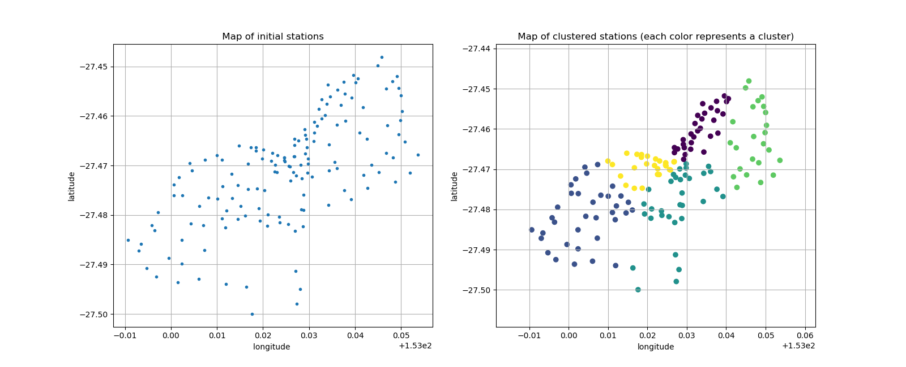

# Geographical Clustering of CityBike‘s Stations in Brisbane

In this mini project we build an *industrialized* code (python 3.6) for unsupervised clustering. The goal is to provide a user-friendly documented code with parameters that are easily modifiable.


## Requirements

Requirements are provided in the file requirements.txt and can be installed using the following pip command

```
pip install -r requirements.txt
```

## Running the code

To run the code, the user needs to specify some hyperparameters and the link to the json file.  These parameters can be changed easily in the main.py file as follows

- nb_clusters : represent the number of cluster (more details on how to choose this parameter in 'More about clustering algorithms')
- seed : The seed for clustering algorithms
- features_names : The name of the features (columns) from the dataset
- algo_clustering : The name of the clustering algorithm that we want to use. As a baseline we suggest : **k-means**, **Agglomerative Clustering** and **Spectral clustering**

```

##### File names directory
file_name = '../data/Brisbane_CityBike.json'

###########################################################################
# Hyperparameters for clustering algorithms and features names in the dataset
###########################################################################
nb_clusters = 5
seed = 111
features_names = ["longitude","latitude"]
#algo_clustering = 'k-means'
algo_clustering = 'agglomerative'
#algo_clustering = 'spectral'

```

and then run the following command in the src
```
cd src
python main.py
```

## Running the code online

Using MyBinder.com, we can easily build a virtual environnement using Docker (with the necessary requirements) and run the code via the browser.
The following link will open a Jupyter Lab tab in the browser. Then we can run a terminal session (Other->Terminal) and be able to execute the code as explained before.
[<center> ](https://mybinder.org/v2/gh/imadelh/clustering-citybike-brisbane/master?urlpath=lab)

## Results

The results of this project are saved in the folder *results* and are as follows:

- A CSV file containing the initial data and an additional column: **clusters**
- A PNG file that contains the plot of the initial stations and the the plot after clustering
[<center> ]
  
- A log-file


**Clusters**

## Implementation details

The implementation is organised as follows:

- `main.py` : Allows the user to run the clustering and save the results
- `data_loader.py` : read the JSON and return a numpy array that contains the observations and their features
- `clustering_algorithms.py` : train a clustering model. To add a new clustering algorithm, one can import it and added to the dictionnary of available clustering algorithms: *algos*
- `data_saver.py` : Save results

## More about clustering algorithms

In this projects we used three different algorithms :  **k-means**, **Agglomerative Clustering** and **Spectral clustering** from SkLearn library. To specify an additional argument, use can refer to the SkLearn documentation and add the name of the argument when we call the clustering algorithm
```
results,model = clustering_algorithms(algo_clustering,training_data,nb_clusters,random_state=seed,**ADD OTHER ARGMUENTS HERE**)
```


Although the goal here is not to implement or analyse the clustering algorithm, but rather to give the user a data science tool to perform a clustering. More details and analysis of **Agglomerative Clustering** and **Spectral clustering** (stability, optimization problem formulation, EigenGap method and choosing the number of clusters) can be found in my project about clustering:
[<center> ](https://github.com/imadelh/Advanced-Machine-Learning/blob/master/Labs_/Lab%20-%202/SemiSupervisedLearning_SpectralClustering.ipynb)

**Choosing number of clusters for K-means**

We remind here a simple method for determining the optimal number of clusters. The Elbrow method consist on  computing the total within-cluster sum of square (WSS) for different values of K (number of clusters) and then Plot the curve of WSS according to the number of clusters k.

The location of a bend in the plot is an indicator of the appropriate number of clusters (around 4 or 5 in this case)

the scripts `elbrow_analysis.py` returns this plot for the case of **K-means**.

<center> 

-------
Imad El Hanafi
